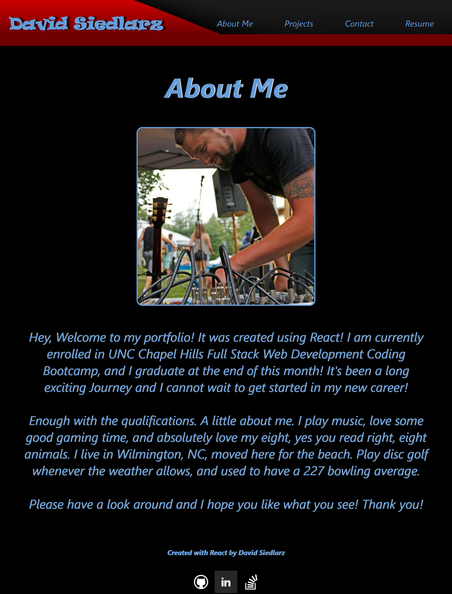

# 19-PWA-Budget-Tracker

  ## Table of Contents
  * [Return to Top](#)
  * [Application Description](#application-description)
  * [Application Dependencies](#application-dependencies)
  * [How to Use](#how-to-use)
  * [Application Built With](#application-built-with)
  * [Screenshot](#screenshot)
  * [Deployed Application](#deployed-application)
  * [Github Repo Location](#github-repo-location)
  * [Contact](#contact)
  
  ## Application Description
  This application was designed with react. This is my portfolio showingabout me, projects, downloadable link to my resume, and a contact me area.
  
  ## Application Dependencies
  * React
  
  ## How to Use
  You can use this application by checking the deployed application
  

  ## Application Built With
  * React
  
  ## Screenshot
  

  ## Deployed Application
  [Click Here](https://dsiedlarz90.github.io/React-Portfolio/)
  
  ## Github Repo Location
 [https://github.com/DSiedlarz90/React-Portfolio](https://github.com/DSiedlarz90/React-Portfolio)

  ## Contact
  Email: Dsiedlarz90@gmail.com